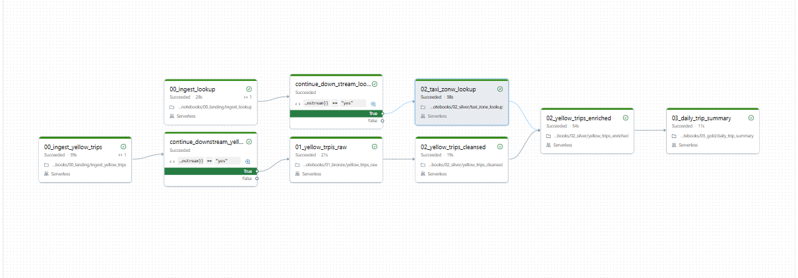

# NYC Taxi Data Pipeline: End-to-End Databricks Lakehouse (Medallion Architecture)

[](https://www.databricks.com/)
[](https://spark.apache.org/)
[](https://delta.io/)
[](https://docs.databricks.com/en/data-governance/unity-catalog/index.html)
[](https://www.python.org/)

An enterprise-grade, scheduled, and automated batch data pipeline for processing New York City Taxi and Limousine Commission (TLC) trip record data. This project implements a **Medallion Architecture** on the **Databricks Lakehouse** platform using PySpark, Delta Lake, and Unity Catalog, incorporating advanced data modeling techniques such as **Slowly Changing Dimensions (SCD) Type 2** and parameterized **incremental loading**.

---

## 1. Solution Architecture & Medallion Design

The pipeline reads raw files (`.parquet` for trip records and `.csv` for taxi zone metadata) from external storage and propagates them through a three-tier schema architecture: **Bronze**, **Silver**, and **Gold**, managed under Unity Catalog's `nyctaxi` namespace.


### Data Maturity Layers

1. **Landing Layer (`data_sources` Volume):**
   - Stores raw ingestion files inside a Unity Catalog Volume.
   - Lookups: `/Volumes/nyctaxi/00_landing/data_sources/lookup/taxi_zone_lookup.csv`
   - Yellow Taxi Trips: `/Volumes/nyctaxi/00_landing/data_sources/nyctaxi_yellow/YYYY-MM/yellow_tripdata_YYYY-MM.parquet`

2. **Bronze Layer (`01_bronze` schema):**
   - **Table:** `yellow_trips_raw` (Delta)
   - **Ingestion:** Absorbs the raw landing files exactly as-is to preserve data lineage.
   - **Audit fields:** Adds a `processed_timestamp` metadata column.

3. **Silver Layer (`02_silver` schema):**
   - **Table 1: `taxi_zone_lookup`**
     - Conforms headers to lowercase snake_case and casts `location_id` to integer.
     - Implements **Slowly Changing Dimensions (SCD) Type 2** to track location attributes (`borough`, `zone`, `service_zone`) over time.
     - Adds metadata fields: `effective_date`, `end_date`, and `current_record` flag.
   - **Table 2: `yellow_trips_cleansed`**
     - Normalizes schema to lowercase snake_case.
     - Converts integer ID categoricals (`vendor_id`, `rate_code_id`, `payment_type`) into human-readable strings.
     - Computes derived metrics (e.g., `trip_duration` in minutes).
     - Standardizes and filters data to discard records falling outside the target processing month.
   - **Table 3: `yellow_trips_enriched`**
     - Resolves location details by joining `yellow_trips_cleansed` against the active dimension records in `taxi_zone_lookup`.
     - Dual-joins to extract both pickup (`pickup_borough`, `pickup_zone`) and dropoff (`dropoff_borough`, `dropoff_zone`) geographic details, removing raw numeric zone IDs.

4. **Gold Layer (`03_gold` schema):**
   - **Table:** `daily_trip_summary` (Delta)
   - **Usage:** Business-level aggregation optimized for BI dashboards (e.g., Power BI, Tableau).
   - **Metrics:** Computes `total_trips`, `average_passengers`, `average_distance`, `average_fare`, `max_fare`, `min_fare`, and `total_revenue` grouped daily by `pickup_date`.

---

## 2. Ingestion & Incremental Processing Strategy

To ensure cost-efficiency and handle real-world reporting delays, the ingestion strategy is divided into two distinct processing modalities:

### Part 1: Historical Backfill (Full Overwrite)
- Processes **6 months of historical data** ranging from **October 2025 to March 2026**.
- Uses `overwrite` writing modes across all layers, establishing a clean baseline for the tables.
- Source scripts are contained in the `one_off/` directory.

### Part 2: Monthly Incremental Processing (Append)
- Runs on a recurring schedule, dynamically processing exactly **one month of data per run**.
- Accounts for a **2-month vendor reporting lag** (e.g., a run in June 2026 will process data for April 2026).
- Switches writing patterns to `append` mode.
- Filters incoming Silver and Gold data streams based on dynamic start/end boundaries of the target month.
- Utilizes `continue_downstream` control variables at the landing step; if target data is already ingested or unavailable, downstream computation is gracefully bypassed to conserve cluster resources.

---

## 3. Slowly Changing Dimensions (SCD Type 2)

The taxi zone lookup dimensions are updated using a robust **SCD Type 2 Merge** routine to capture updates (e.g., renaming a zone or redistributing boundaries) without breaking historical reports:

```
                  ┌─────────────────────────────────────────┐
                  │          Incoming Zone Records          │
                  └────────────────────┬────────────────────┘
                                       │
            ┌──────────────────────────┴──────────────────────────┐
            ▼                                                     ▼
┌──────────────────────┐                              ┌──────────────────────┐
│  Modified Dimensions │                              │   New Dimensions     │
│ (IDs match, values   │                              │  (IDs not present    │
│  differ from active) │                              │    in target table)  │
└──────────┬───────────┘                              └──────────┬───────────┘
           │                                                     │
           ├─────────────────────────┐                           │
           ▼                         ▼                           ▼
┌──────────────────────┐  ┌──────────────────────┐    ┌──────────────────────┐
│   1. CLOSE OLD ROW   │  │   2. INSERT NEW ROW  │    │ 3. INSERT ACTIVE ROW │
│ Set end_date = now   │  │ Set eff_date = now   │    │ Set eff_date = now   │
│ Set current = False  │  │ Set end_date = NULL  │    │ Set end_date = NULL  │
└──────────────────────┘  └──────────────────────┘    └──────────────────────┘
```

1. **Pass 1 (Close Updates):** Finds matches between the source and target where textual values differ. Updates the existing active records in the target Delta table, setting `end_date = runtime_timestamp` and `current_record = false`.
2. **Pass 2 (Insert Updates):** Re-inserts the modified records as new rows with `effective_date = runtime_timestamp` and `end_date = NULL`.
3. **Pass 3 (Insert New):** Appends completely new zone records with `effective_date = runtime_timestamp` and `end_date = NULL`.

---

## 4. Pipeline Orchestration & Workflow DAG

The automation of this pipeline is managed via a serverless **Databricks Workflow Job** named `NYC_taxi_job`. The workflow incorporates complex conditional checks to ensure process integrity.



### DAG Task Nodes
- **`00_ingest_lookup`:** Fetches the zone lookup file and checks if an update is required.
- **`continue_downstream_lookup` (If/Else):** Evaluates if zone updates exist. If yes, triggers `02_taxi_zone_lookup` to run the SCD Type 2 merge.
- **`00_ingest_yellow_trips`:** Computes target month boundaries (applying 2-month lag) and downloads the corresponding trip parquet from the TLC portal.
- **`continue_downstream_yellow` (If/Else):** Checks if the parquet exists. If yes, launches the core Spark pipeline.
- **`01_yellow_trips_raw`:** Bronze ingestion task.
- **`02_yellow_trips_cleansed`:** Performs cleansing, mapping, and out-of-bounds filtering.
- **`02_yellow_trips_enriched`:** Dual-joins cleansed trips to active zones. *Depends on both `02_yellow_trips_cleansed` and `02_taxi_zone_lookup` completing successfully*.
- **`03_daily_trip_summary`:** Builds aggregated metrics for the Gold layer.

---

## 5. Repository Structure

The codebase is clearly separated into one-off setup scripts, exploratory analysis, and production pipelines:

```text
nyctaxi_pipeline/
├── ad_hoc/                                     # Exploratory data analysis (EDA) & helper utilities
│   └── [yellow_taxi_eda.ipynb](ad_hoc/yellow_taxi_eda.ipynb)              # Notebook containing local profiling of TLC dataset
├── docs/                                       # Architecture blueprints & visual assets
│   ├── [medallion_final.gif](docs/medallion_final.gif)              # Animation demonstrating Medallion tier data propagation
│   └── [orchestration.png](docs/orchestration.png)                # Screen capture of Databricks Workflow Job DAG
├── one_off/                                    # Initial deployment & database setup
│   ├── [creating_catalogs_schema_volume.ipynb](one_off/creating_catalogs_schema_volume.ipynb) # DDL script for Catalog, Schemas, & Volume creation
│   └── initial_load/                           # Base load pipelines (Full overwrite mode)
│       └── notebooks/
│           ├── 00_landing/
│           │   ├── [backfill_historical_yellow_trips.ipynb](one_off/initial_load/notebooks/00_landing/backfill_historical_yellow_trips.ipynb) # Downloads historical Oct 2025 - Mar 2026 data
│           │   └── [load_taxi_zone_lookup.ipynb](one_off/initial_load/notebooks/00_landing/load_taxi_zone_lookup.ipynb) # Sets up initial lookup file in volume
│           ├── 01_bronze/
│           │   └── [yellow_trips_raw.ipynb](one_off/initial_load/notebooks/01_bronze/yellow_trips_raw.ipynb)     # Writes historical raw data to Bronze Delta table
│           ├── 02_silver/
│           │   ├── [taxi_zone_lookup.ipynb](one_off/initial_load/notebooks/02_silver/taxi_zone_lookup.ipynb)    # Loads base taxi zones dimension table
│           │   ├── [yellow_trips_cleansed.ipynb](one_off/initial_load/notebooks/02_silver/yellow_trips_cleansed.ipynb) # Cleanses and structures the historical trip data
│           │   └── [yellow_trips_enriched.ipynb](one_off/initial_load/notebooks/02_silver/yellow_trips_enriched.ipynb) # Dual-joins trips with location data
│           └── 03_gold/
│               └── [daily_trip_summary.ipynb](one_off/initial_load/notebooks/03_gold/daily_trip_summary.ipynb)   # Initial aggregate daily statistics calculations
├── transformations/                            # Production pipelines (Automated incremental load)
│   └── notebooks/
│       ├── 00_landing/
│       │   ├── [ingest_lookup.ipynb](transformations/notebooks/00_landing/ingest_lookup.ipynb)             # Ingests zone metadata check increment
│       │   └── [ingest_yellow_trips.ipynb](transformations/notebooks/00_landing/ingest_yellow_trips.ipynb)       # Computes lag month & retrieves month increment parquet
│       ├── 01_bronze/
│       │   └── [yellow_trips_raw.ipynb](transformations/notebooks/01_bronze/yellow_trips_raw.ipynb)           # Appends incremental data to raw Delta tables
│       ├── 02_silver/
│       │   ├── [taxi_zone_lookup.ipynb](transformations/notebooks/02_silver/taxi_zone_lookup.ipynb)          # Run SCD Type 2 logic for dimension changes
│       │   ├── [yellow_trips_cleansed.ipynb](transformations/notebooks/02_silver/yellow_trips_cleansed.ipynb)       # Cleanses data and drops out-of-boundary dates
│       │   └── [yellow_trips_enriched.ipynb](transformations/notebooks/02_silver/yellow_trips_enriched.ipynb)       # Appends joined location trip records
│       └── 03_gold/
│           └── [daily_trip_summary.ipynb](transformations/notebooks/03_gold/daily_trip_summary.ipynb)         # Appends incremental monthly calculations to Gold summary
├── .gitignore                                  # Standard Git exclusion file
├── project_documentation.md                    # Core project specifications and architecture brief
└── README.md                                   # Project documentation and showcase dashboard (this file)
```

---

## 6. How to Deploy & Run the Pipeline

### Prerequisites
- Active Databricks Workspace with Unity Catalog enabled.
- External cloud storage (e.g., Azure ADLS Gen2, AWS S3) configured for managed catalog locations.
- Databricks Serverless Compute or Single User Cluster running Databricks Runtime (DBR) 14.3 LTS or above.

### Step 1: Initialize Unity Catalog Objects
1. Open the [creating_catalogs_schema_volume.ipynb](one_off/creating_catalogs_schema_volume.ipynb) notebook in Databricks.
2. Edit the managed location URI (e.g. `abfss://...`) to match your storage containers.
3. Run the notebook to initialize the `nyctaxi` catalog, the schemas (`00_landing`, `01_bronze`, `02_silver`, `03_gold`), and the raw file `data_sources` Volume.

### Step 2: Ingest and Backfill Historical Baseline Data
1. Navigate to the `one_off/initial_load/notebooks/` directory.
2. Run `00_landing/load_taxi_zone_lookup.ipynb` and `00_landing/backfill_historical_yellow_trips.ipynb` to download the initial lookup CSV and the 6 months of historical yellow taxi parquet files (Oct 2025 to Mar 2026).
3. Sequentially execute the remaining bronze, silver, and gold notebooks in `one_off/initial_load/notebooks/` to process the data and establish the base Delta tables in overwrite mode.

### Step 3: Deploy the Incremental Workflow
1. In Databricks Workflows, create a new Job called `NYC_taxi_job`.
2. Configure task nodes matching the workflow DAG described in Section 4. Link the notebooks under `transformations/notebooks/` to their corresponding tasks.
3. Set the cluster compute to Serverless or a shared cluster.
4. Schedule the job to run monthly.
   - *Example Run context:* An execution scheduled for June 2026 will automatically extract boundaries for April 2026, pull the correct parquet file, run validations, merge dimension changes using SCD Type 2, and append the processed records downstream to Gold.
