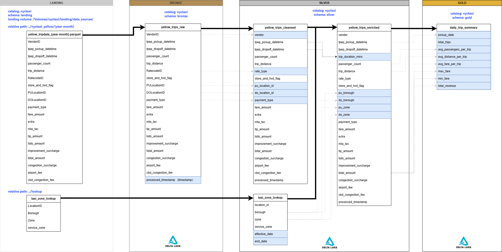

# NYC Yellow Taxi Data Pipeline

A batch data pipeline built on **Databricks** that processes yellow taxi trip data using the **Medallion Architecture** (Bronze to Silver to Gold). The pipeline covers 6 months of historical data (**October 2025 to March 2026**) with a monthly incremental load going forward.

**Tools:** Databricks, PySpark, Delta Lake, Unity Catalog, Databricks Workflows

---

## Architecture



The project works with two source files:

| File | Format | Description |
|---|---|---|
| `yellow_tripdata_YYYY-MM.parquet` | Parquet | Monthly yellow taxi trip records |
| `taxi_zone_lookup.csv` | CSV | Maps location IDs to borough and zone names |

Data flows through four layers managed inside the `nyctaxi` Unity Catalog.

---

## Data Layers

### Landing — `00_landing` (Volume: `data_sources`)

Raw files are downloaded and stored exactly as-is. No transformations happen here.

```
data_sources/
├── lookup/taxi_zone_lookup.csv
└── nyctaxi_yellow/YYYY-MM/yellow_tripdata_YYYY-MM.parquet
```

### Bronze — `01_bronze`

| Table | What it does |
|---|---|
| `yellow_trips_raw` | Loads the raw Parquet into a Delta table. Adds a `processed_timestamp` column. Everything else stays exactly as in the source file. |

### Silver — `02_silver`

| Table | What it does |
|---|---|
| `taxi_zone_lookup` | Cleans column names. Keeps a history of any changes to zone names or boroughs over time. |
| `yellow_trips_cleansed` | Converts coded IDs (vendor, payment type, rate code) to readable text. Calculates trip duration in minutes. Drops records outside the target month. |
| `yellow_trips_enriched` | Joins the cleansed trips against the zone lookup twice (once for pickup, once for dropoff) to add borough and zone name to every trip record. |

### Gold — `03_gold`

| Table | What it does |
|---|---|
| `daily_trip_summary` | Groups trips by pickup date and computes: total trips, average fare, average distance, average passengers, max fare, min fare, and total revenue. Ready to plug into a BI tool. |

---

## How the Pipeline Runs

### Part 1 — Historical Backfill (run once)

Loads 6 months of historical data from **October 2025 to March 2026** in overwrite mode. This sets up the initial baseline tables.

### Part 2 — Monthly Incremental Load (runs on a schedule)

Runs every month and appends one new month of data.

Because taxi data is typically published with a 2-month delay, each run targets the month 2 months before the current date:

> Run in **June 2026** processes **April 2026** data

If the file for the target month is already downloaded, or hasn't been published yet, the pipeline exits early without running unnecessary compute.

---

## Orchestration


The pipeline runs as a **Databricks Workflow Job** with the following tasks:

1. `00_ingest_lookup` — Downloads the zone lookup file if a new version exists
2. `continue_downstream_lookup` — Stops here if no lookup update is needed
3. `02_taxi_zone_lookup` — Updates the zone lookup table in Silver
4. `00_ingest_yellow_trips` — Downloads the monthly trip Parquet file
5. `continue_downstream_yellow` — Stops here if no new trip file is available
6. `01_yellow_trips_raw` — Loads raw trips into Bronze
7. `02_yellow_trips_cleansed` — Cleans and formats trips in Silver
8. `02_yellow_trips_enriched` — Joins trips with zones (depends on steps 3 and 7 both finishing)
9. `03_daily_trip_summary` — Writes daily aggregates to Gold

---

## Folder Structure

```
nyctaxi_pipeline/
|
+-- one_off/                         # Run once during initial setup
|   +-- creating_catalogs_schema_volume.ipynb
|   +-- initial_load/
|       +-- notebooks/
|           +-- 00_landing/          # Downloads Oct 2025 to Mar 2026 data
|           +-- 01_bronze/           # Loads raw data into Bronze (overwrite)
|           +-- 02_silver/           # Builds Silver tables (overwrite)
|           +-- 03_gold/             # Builds Gold summary (overwrite)
|
+-- transformations/                 # Runs every month on a schedule
|   +-- notebooks/
|       +-- 00_landing/              # Downloads the new monthly file
|       +-- 01_bronze/               # Appends new raw data to Bronze
|       +-- 02_silver/               # Appends to Silver tables
|       +-- 03_gold/                 # Appends new monthly summary to Gold
|
+-- ad_hoc/
|   +-- yellow_taxi_eda.ipynb        # Exploratory analysis
|
+-- docs/
|   +-- nyctaxi_project_architecture.png
|   +-- orchestration.png
|
+-- .gitignore
+-- README.md
```

---

## How to Set Up and Run

**Step 1 — Create the catalog, schemas, and storage volume**

Open `one_off/creating_catalogs_schema_volume.ipynb` in Databricks and run all cells. This creates the `nyctaxi` catalog, the four schemas, and the `data_sources` volume.

**Step 2 — Load the historical data**

Run the notebooks in `one_off/initial_load/notebooks/` in order: landing, then bronze, then silver, then gold. This loads all 6 months of historical data.

**Step 3 — Deploy the monthly scheduled job**

In Databricks Workflows, create a new job that points to the notebooks in `transformations/notebooks/` and schedule it to run monthly.
